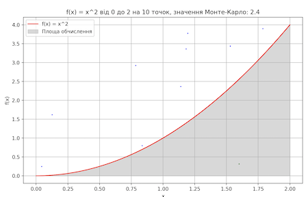
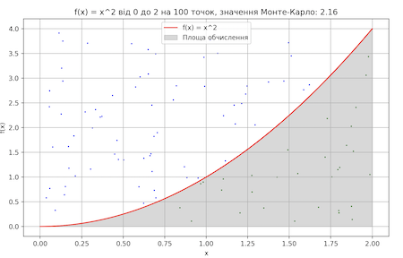
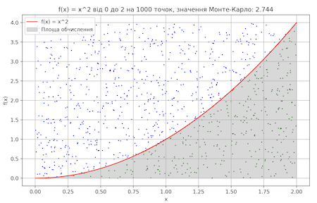
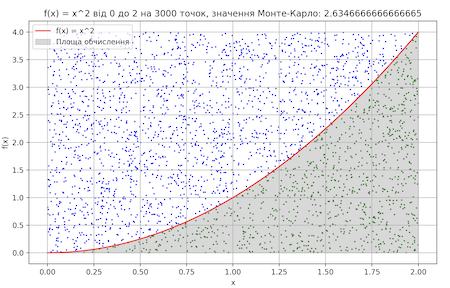
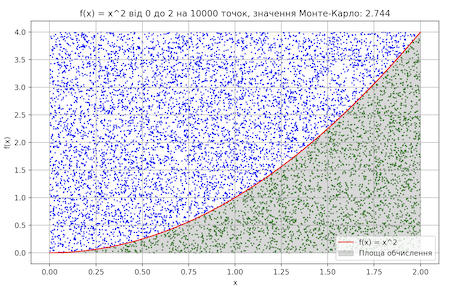
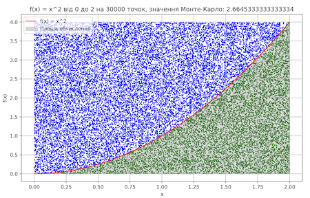
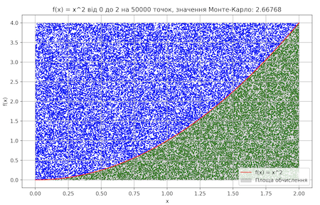

# Домашнє завдання 10

Перед виконанням встановіть залежності, якщо треба.

```
pip install -r requirements.txt
```

## Залежності

-   pulp
-   matplotlib
-   scipy
-   numpy

## Завдання 1. Оптимізація виробництва.

Компанія виробляє два види напоїв: "Лимонад" і "Фруктовий сік". Для виробництва цих напоїв використовуються різні інгредієнти та обмежена кількість обладнання. Задача полягає у максимізації виробництва, враховуючи обмежені ресурси.

**Умови завдання**:

1. "Лимонад" виготовляється з "Води", "Цукру" та "Лимонного соку".
2. "Фруктовий сік" виготовляється з "Фруктового пюре" та "Води".
3. Обмеження ресурсів: 100 од. "Води", 50 од. "Цукру", 30 од. "Лимонного соку" та 40 од. "Фруктового пюре".
4. Виробництво одиниці "Лимонаду" вимагає 2 од. "Води", 1 од. "Цукру" та 1 од. "Лимонного соку".
5. Виробництво одиниці "Фруктового соку" вимагає 2 од. "Фруктового пюре" та 1 од. "Води".

Використовуючи PuLP, створіть модель, яка визначає, скільки "Лимонаду" та "Фруктового соку" потрібно виробити для максимізації загальної кількості продуктів, дотримуючись обмежень на ресурси. Напишіть програму, код якої максимізує загальну кількість вироблених продуктів "Лимонад" та "Фруктовий сік", враховуючи обмеження на кількість ресурсів.

### Виконання

Домашнє завдання виконано у файлі task_1.py.

### Приклад запуску програми

```
python task_1.py
```

### Приклад роботи програми

Запуск програми

```
python task_1.py
```

Результат виконання

```
Задача успішно розв'язана з оптимальним рішенням.
Оптимальна кількість:
 - Лимонад: 30.0
 - Фруктовий_сік: 20.0
Максимальна продуктивність: 50
```

## Завдання 2. Обчислення визначеного інтеграла.

Завдання полягає в обчисленні значення інтеграла функції методом Монте-Карло.

1. Обчисліть значення інтеграла функції за допомогою методу Монте-Карло, інакше кажучи, знайдіть площу під цим графіком (сіра зона).
2. Перевірте правильність розрахунків, щоб підтвердити точність методу Монте-Карло, шляхом порівняння отриманого результату та аналітичних розрахунків або результату виконання функції quad. Зробіть висновки.

### Виконання

Домашнє завдання виконано у файлі task_2.py.

### Приклад роботи програми

Запуск програми

```
python task_2.py
```

Результат виконання

```
Значення інтегралу функції quad: 2.666666666666667
Значення інтегралу методом Монте-Карло на різних вибірках:
Кількість точок | Значення інтегралу
10              | 2.4
100             | 2.32
1000            | 2.456
3000            | 2.6986666666666665
10000           | 2.6216
30000           | 2.6544
50000           | 2.67232
```

Як видно з результатів тесту, значення має тенденцію наближатися до очікуваного значення, коли кількість експериментів та вибіркових даних стає більше. У даному випадку при кількості точок у 50000 результат методу Монте-Карло є більш наближеним до очікуваного значення.

### Візуалізація графа для різної кількості точок








